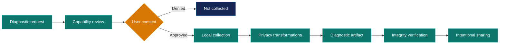
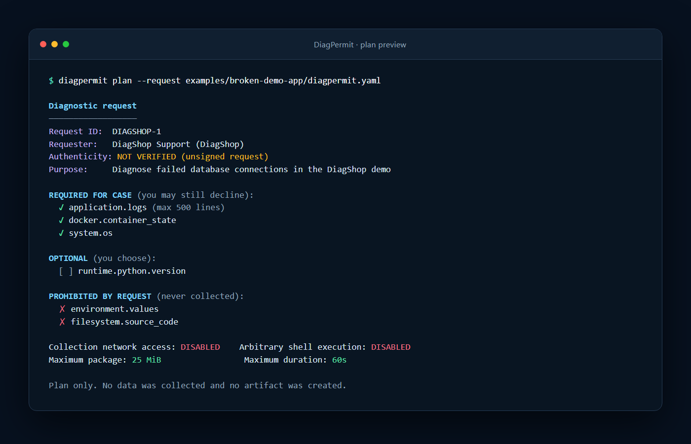
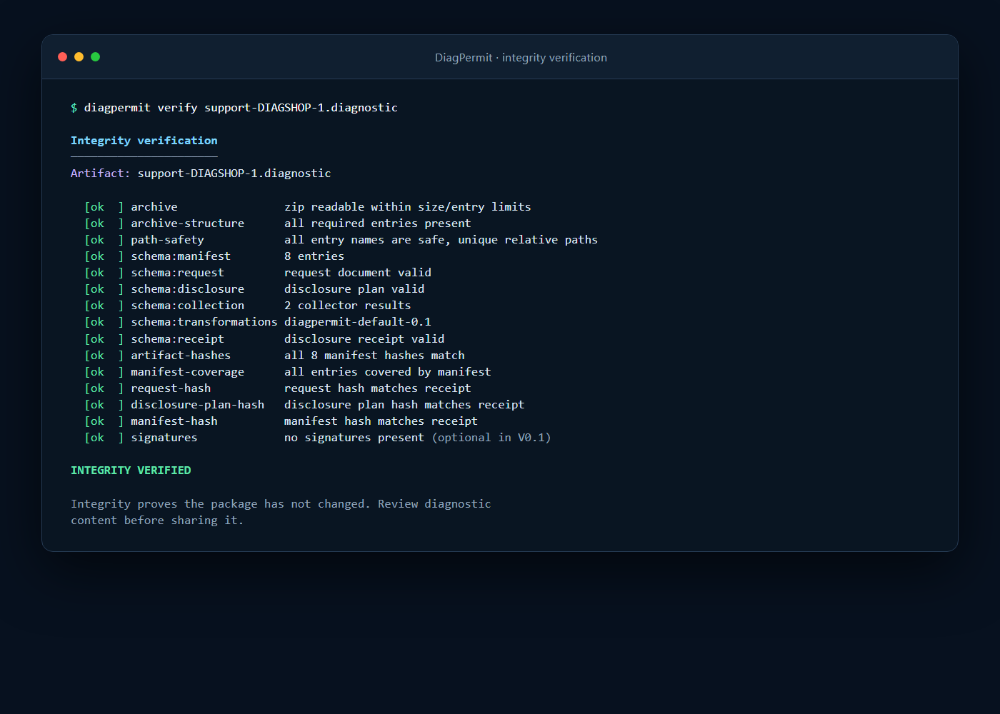

# DiagPermit

<p align="center">
  
</p>

<p align="center">
  <strong>Know what you are sharing before you send diagnostics.</strong>
</p>

<p align="center">
  <a href="https://github.com/Irish-Joseph/diagpermit/actions/workflows/ci.yml"></a>
  <a href="LICENSE"></a>
  
  
</p>

DiagPermit is an open protocol and reference CLI for **consent-driven diagnostic exchange**. A support team declares exactly what it needs, the user reviews and approves those capabilities, collection and privacy transformations happen locally, and the resulting artifact records what was requested, approved, collected, and transformed.

> [!IMPORTANT]
> DiagPermit is an early-stage project. The protocol and CLI may evolve before the first stable release. See [TRADEMARKS.md](TRADEMARKS.md).

## Why DiagPermit?

“Send us your logs” is easy to ask and difficult to trust. Users may not know what a support bundle contains, requesters may receive excessive or irrelevant data, and neither side may have a durable record of the disclosure decision.

DiagPermit makes that boundary explicit:

- requesters declare individual diagnostic capabilities and hard limits;
- users can approve or deny each capability, including ones marked required;
- collection stays local and is bounded by filesystem, time, and size policies;
- configured privacy transformations run before packaging;
- the artifact includes an integrity manifest and disclosure receipt; and
- sharing remains a separate, deliberate action outside DiagPermit.

## How it works



The `.diagnostic` artifact is a bounded ZIP package containing collected data plus protocol records:

| Record | Purpose |
| --- | --- |
| Diagnostic request | Declares purpose, capabilities, policy, expiry, and retention notice |
| Consent decision | Records how every requested capability was approved or denied |
| Effective disclosure plan | Freezes what may be collected before collection begins |
| Collection report | Records per-capability success, failure, denial, timeout, and limits |
| Transformation report | Records which detectors ran and how many values changed—never the original values |
| Manifest and receipt | Bind package contents, request, and plan with canonical SHA-256 hashes |

### Real CLI output

These screenshots were captured from the current CLI—not from a design mockup.

**Review the disclosure plan before collection:**

<p align="center">
  
</p>

**Verify the finished diagnostic artifact:**

<p align="center">
  
</p>

## Quick start

### Requirements

- Go 1.27.1 or newer
- Linux, macOS, or Windows
- Docker only if Docker diagnostics or the demo are needed

### Build

```bash
git clone https://github.com/Irish-Joseph/diagpermit.git
cd diagpermit
go build -o diagpermit ./cmd/diagpermit
./diagpermit --version
```

On Windows PowerShell, run the binary as `.\diagpermit.exe`.

### Create and review a request

```bash
./diagpermit init
./diagpermit validate diagpermit.yaml
./diagpermit plan
```

`plan` is read-only: it shows the requester, purpose, capability requirements, network and shell policy, retention notice, and collection limits without collecting data.

### Collect, inspect, and verify

```bash
./diagpermit collect
./diagpermit inspect support-CASE-LOCAL.diagnostic
./diagpermit verify support-CASE-LOCAL.diagnostic
```

For automation, consent must still be explicit:

```bash
./diagpermit collect --yes
./diagpermit collect --consent consent.json
```

See the [full quick start](docs/quickstart.md) and [broken demo application](examples/broken-demo-app/README.md) for an end-to-end scenario.

## Commands

| Command | What it does |
| --- | --- |
| `diagpermit init` | Creates a documented `diagpermit.yaml` request template |
| `diagpermit validate [file]` | Strictly validates configuration and rejects unknown fields |
| `diagpermit plan` | Previews requested capabilities and limits without collection |
| `diagpermit collect` | Runs consent → collection → transformation → packaging |
| `diagpermit inspect <artifact>` | Displays a terminal-friendly artifact summary |
| `diagpermit verify <artifact>` | Verifies archive structure, hashes, schemas, and receipt links |
| `diagpermit redact-test [file]` | Previews privacy transformations on local input |
| `diagpermit collectors` | Lists built-in collectors and declared capabilities |
| `diagpermit doctor` | Checks the local CLI environment |

## Security and privacy model

DiagPermit is local-first by design:

- no account, mandatory server, hidden telemetry, or automatic upload;
- network access is disabled unless the request and effective plan allow it;
- arbitrary shell execution is rejected in protocol 0.1;
- file reads are bounded to an allowed root and reject symlinks by default;
- archives reject traversal paths, duplicate entries, excessive entries, and decompression limits;
- mandatory transformation failures stop the pipeline without producing a shareable artifact; and
- verification checks integrity, not privacy completeness.

> [!WARNING]
> Pattern-based transformations cannot guarantee that every secret or personal value has been removed. Always inspect diagnostic content before sharing it. `diagpermit verify` proves package integrity according to the verification model; it does **not** prove that the package is safe to disclose.

Read the [security model](docs/security.md), [threat model](docs/threat-model.md), and [vulnerability reporting policy](SECURITY.md).

## Architecture

```text
cmd/diagpermit/     CLI commands
collectors/         Typed system, runtime, application, and Docker collectors
internal/           Consent, collection, transformation, packaging, and verification
pkg/protocol/       Public protocol types and canonical JSON hashing
conformance/        Portable protocol test vectors
testdata/           Synthetic secret corpus—never real user data
examples/           Demonstration applications
docs/               Guides, design notes, security docs, and README assets
```

The package boundaries intentionally keep the public protocol model small while implementation details remain under `internal/`. See the [protocol overview](docs/protocol-overview.md) and [documentation index](docs/README.md).

## Development

```bash
go test -count=1 ./...
go test -count=1 -v ./conformance/
go vet ./...
gofmt -l .
```

CI runs build, formatting, vet, tests, conformance, security-oriented linting, and CodeQL across Linux, Windows, and macOS where applicable.

## Project scope

DiagPermit is not an observability platform, monitoring agent, ticketing system, remote-management tool, cloud support portal, or replacement for mature collectors such as `sosreport`. Its focus is the consent, disclosure, and integrity boundary around diagnostic exchange. Existing collectors can become adapters in later versions.

## Contributing

The project is open for review and early contributions. Start with [CONTRIBUTING.md](CONTRIBUTING.md), follow the [Code of Conduct](CODE_OF_CONDUCT.md), and open an issue before proposing protocol changes. Never submit real credentials, customer logs, or employer data.

Security vulnerabilities must be reported privately as described in [SECURITY.md](SECURITY.md).

## License

Licensed under the [Apache License 2.0](LICENSE).
