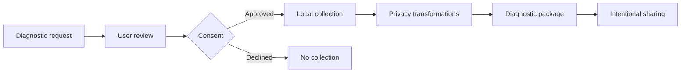

# DiagPermit

**A consent-driven approach to sharing software diagnostics.**

DiagPermit is an open-source project exploring a safer, clearer way for users and support teams to exchange diagnostic information. Instead of a vague request to "send the logs," a requester should describe what information is needed, the user should be able to review and approve that request, and collection should happen locally under explicit limits.

> [!IMPORTANT]
> This repository is currently in the planning stage. There is no usable release or published protocol specification yet.

## Why this project is needed

Troubleshooting often requires logs, configuration, system details, and other diagnostic data. Today, that exchange can be difficult to reason about:

- users may not know exactly what they are sharing;
- support teams may receive too much data, too little data, or the wrong data;
- sensitive information can be included unintentionally;
- approvals and transformations are rarely recorded in a consistent way; and
- recipients may have no reliable way to verify how a diagnostic package was produced.

DiagPermit aims to make this exchange intentional and auditable, while keeping the user in control.

## The idea

At a high level, the project is intended to support a workflow in which:

1. A requester declares the diagnostic information they need.
2. The user reviews the request and makes an explicit choice.
3. Approved data is collected locally under defined restrictions.
4. Privacy transformations are applied before sharing.
5. The resulting package carries a record of what was requested, approved, and processed.

## Guiding principles

- **Consent first:** diagnostic access should be understandable and explicitly approved.
- **Local control:** collection and review should happen on the user's system before anything is shared.
- **Data minimization:** collect only what is necessary for the stated diagnostic purpose.
- **Transparency:** make requests, approvals, and transformations visible.
- **Verifiability:** enable recipients to check the integrity and provenance of diagnostic artifacts.
- **Open collaboration:** develop the approach in public with community review.

## What DiagPermit is not

DiagPermit is not intended to be an observability platform, monitoring agent, ticketing system, remote-management tool, or a replacement for existing troubleshooting products. Its focus is the consent and trust boundary around diagnostic exchange.

## Project status

The project is in **pre-development**. This repository currently establishes the problem, vision, and principles. Protocol design, implementation, contribution guidance, and release plans will be published as they become ready for public review.

If this problem interests you, watch the repository for updates. Issues and contribution workflows will open when the initial public development phase begins.

## License

This project is licensed under the [Apache License 2.0](LICENSE).
